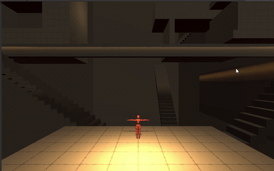

## What I Do 
##### Things I'm skilled at and passionate about.
I enjoy learning and building at the intersection of technology and art:
- Game Design
- Game Development
- Computer Graphics
- Artificial Intelligence

## Projects
##### Some of my latest work.

|  |  |
|:-------------:|:------------------|
|| Trash Panda   `Unity`  `C#`   A 3D action platform game.     <i class="fas fa-bullhorn fa-fw"></i> [Beta Trailer](https://drive.google.com/open?id=1usFyJ05wTuv_eQOb6xLRQSFDuo-eD2T3)! (2019.12.03) |
|| IR:IS   `Unity` `C#`    A 3D infinite runner game.    <i class="fas fa-bullhorn fa-fw"></i> Currently greyboxing and iterating mechanics (2019.12.28) |
|| Physics-based Mass String system   `C++`   Fast modeling algorithm based on physics of mass string systems    | 
|| Duet   `MERN stack`   A One-Stop Licensing Solution for Starting Business Owners.  |

## About Me

Hello! This is Lori Jia, a Computer Science student at The University of Toronto. Since I discovered my interest in creating games in September 2019, I've been working on two Unity games, _Trash Panda_ with a cross-disciplinary team, and _IR:IS_ by myself. 

After I found my passion for games, I started to become interested in _Computer Graphics_. I spend hours on websites like Shadertoy to explore and learn. Academically, I focused on _Artificial Intelligence_. As it may apply to every engineer, I also enjoy designing and developing for little pain points in everyday life. 

At times when I'm not pondering design decisions, learning code, or cramming for school, I watch anime, draw, or swim. 

You are welcome to view my portfolio, and feel free to get in touch!

<!--PIXIV: https://www.pixiv.net/en/users/9644834 -->
