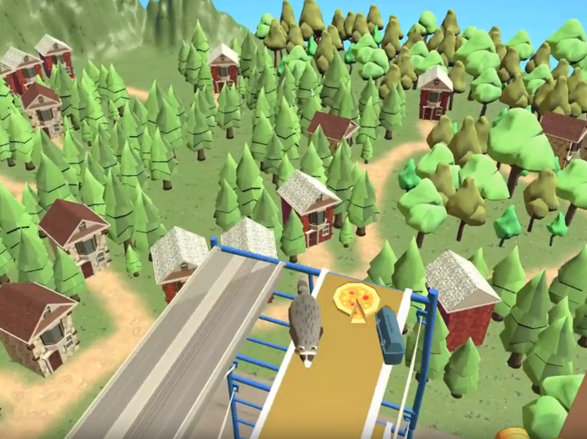

# (this site is currently **under construction** - will be done tomorrow! 2020.02.02) 

## What I Do 
##### Things I'm skilled at and passionate about.
I enjoy learning and building at the intersection of technology and art:
- Game Design
- Game Development
- Computer Graphics
- Artificial Intelligence

## Projects
##### Some of my latest work.

|Duet    `MERN stack`  |    |
|:-------------:|:------------------:|
|              |  A One-Stop Licensing Solution for Starting Business Owners.  |

|TrashPanda    `Unity`   `C#` |    |
|:-------------:|:------------------:|
|              |  A 3D Action Platform Game.    :loudspeaker: Check out our [Beta Trailer](https://drive.google.com/open?id=1usFyJ05wTuv_eQOb6xLRQSFDuo-eD2T3)! |

| IR:IS    `Unity`   `C#`  ||
|:-------------:|:------------------:|
|              | A 3D Infinite Runner Game.  |
  
| Shader    `GLSL`    | |
|:-------------:|:------------------:|
|              |  |   

## About Me
##### Get to know me.

Hello! This is Lori Jia, a Computer Science student at The University of Toronto. Since I discovered my interest in creating games in September 2019, I've been working on two Unity games, _Trash Panda_ with a cross-disciplinary team, and _IR:IS_ by myself. 

After I found my passion in games, I started to become interested in _Computer Graphics_. I spend hours on websites like Shadertoy to explore and learn. Academically, I focused on _Artificial Intelligence_ and _Theory of Computation_. I also enjoy designing and developing to solve pain points in life. 

At times when I'm not pondering design decisions, learning code, or cramming for school, I watch anime, draw, or swim. 

You are welcome to view my portfolio, and feel free to get in touch!

<!-- * * * -->

<!-- 
## Contact
##### Get in touch.
- [GitHub](https://github.com/jialori)
- [LinkedIn](https://www.linkedin.com/in/lori-jia-487030138/)
- [Resume](https://drive.google.com/open?id=1xBoQev8nE7k00Np-H0JbqncXR44-roNY)
 -->

<!--PIXIV: https://www.pixiv.net/en/users/9644834 -->