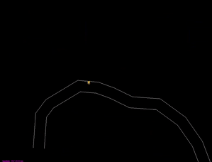

## Projects

##### Some lastest work.

* * *

 

` C++ ` `2020-10-23`

A game that challenges players to reach the end of the road through a space that invisible monsters wander.

* * *

 

### Audio Visualizer

`Unity` `ShaderLab` 

An experiment project where I create different visual effects and shaders that change with audio signals.

* * *

### Physics-based Mass String system

`C++`

Implemented the modeling algorithm from [this research paper](http://graphics.berkeley.edu/papers/Liu-FSM-2013-11/Liu-FSM-2013-11.pdf), a fast simulation solution for the physics of mass string systems

* * *

 

 

<h3>TrashPanda</h3> 

<code>Unity</code>  `C#`

<i class="fas fa-bullhorn fa-fw"></i> [Beta Trailer](https://youtu.be/V5wO-z483DQ)! (2019.12.03) 

* * *

 

### Infinity Space 

`Unity` `C#` 

Greyboxing (2019.12.28) 

***

<section class="sectiondivider"></section>

## About

Hello, I am a software developer currently working in the Interactive Entertainment Group at Tecent. This is the space where I stack my personal projects. I design and develop products and games for fun.  
<!-- At times when I'm not coding, I <a href="./draw" class="hidden">doodle</a>. -->

Feel free to get in touch at jialori.LJ@gmail.com for career or collaboration opportunities, interesting projects, or simply chat.

